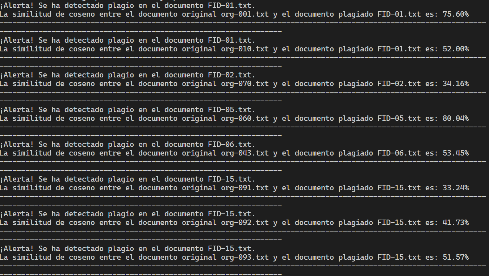
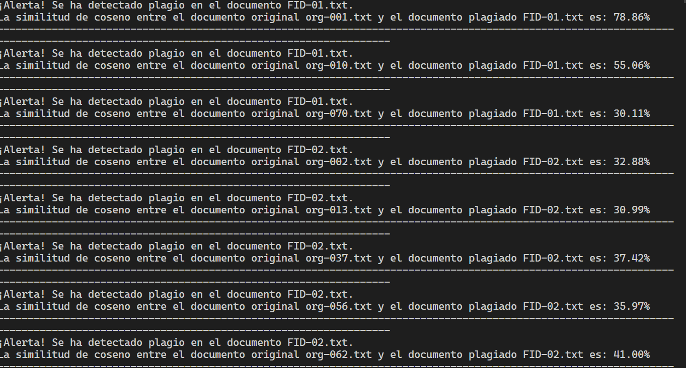
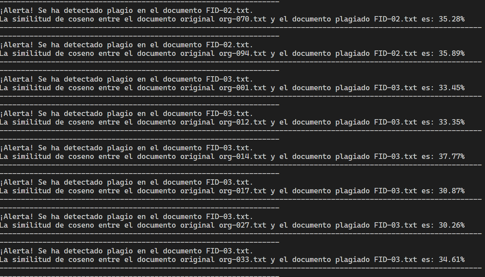
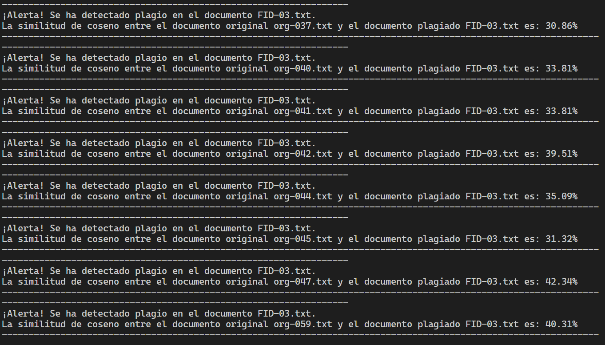

# Obtained results

## Using 3n-grams

After running the unit tests, we found out that the ideal number of n-grams is 3.  
When using 3 n-grams we obtain the following results:

## Using 2n-grams

After running the unit tests, we found out that using 2 n-grams is not the best approach.  
When using 2 n-grams we obtain the following results (missing some):

